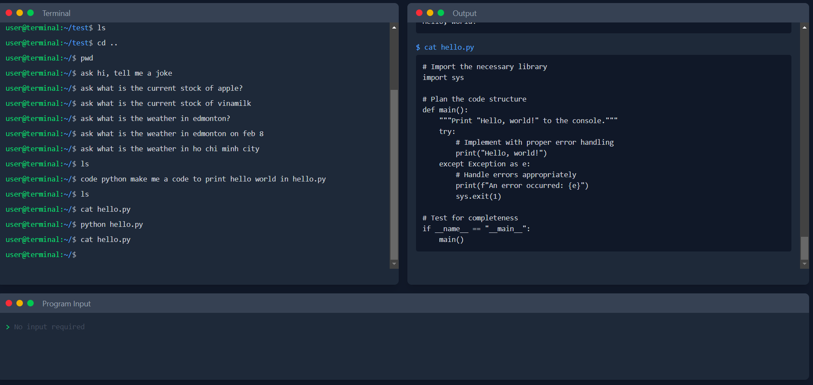

# PDEVIN  
🚀 **AI-Powered Linux Coding Assistant** (Inspired by Devin, but actually PDEVIN – Pseudo DEVIN)  

This project features an **LLM (Large Language Model)** that interacts with a simulated **Linux environment**, enabling:  

✅ **Code Execution** – Runs Python code within the environment.  
✅ **Self-Analysis** – Evaluates its own output and provides feedback.  
✅ **Auto-Correction** – Iteratively fixes its own code to improve accuracy.  

Currently, it **only supports Python** and requires manual input for related files. Web hosting functionality is **not yet implemented**.  
---
This project going to have a long way to go since its still a prototype version.

## 🎥 Demo  
[](https://www.youtube.com/watch?v=kAvirKTBOnw)  

---

## 🚀 Installation & Usage  

### 1 **Set Up API Key**  
- Get a **GEMINI_API_KEY** (currently only configured for Gemini).  
- Create a `.env` file in the root directory and add your key:  
  ```env
  GEMINI_API_KEY=your_api_key_here
  ```
### 2 **Install Dependencies**  
- Run the following command to install necessary packages:
  ```env
  npm install
  ```
### 3 **Run the Backend Server**  
- Start the backend server using:
  ```env
  npx tsx server/server.ts
  ```
### 4 **Start the Frontend**  
- Run the frontend with:
  ```env
  npm run dev
  ```

  ## 🖼️ Prototype Preview  
  

## 🔧 Future Improvements  
- Support for multiple programming languages.  
- Automated file handling for related dependencies.  
- Web hosting capabilities for broader accessibility.  
- Mutiple tab implementation.
- locally run LLM implementation (Deepseek, Llama 2)